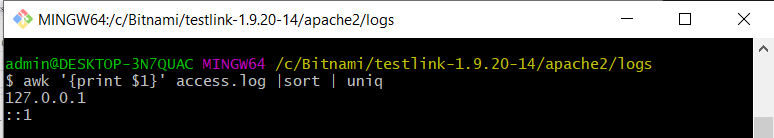

# Apache Server. Логи.
## Access-лог.

*Запустила сервер с TestLink.*

*Создала контент для лог-файлов в TestLink (проект, тест-планы, тест-кейсы).*

*Для работы с логами использовала Git bash и linux-команды*
### Информация из Access-лога:
* Определила с каких IP-адресов были заходы.

* Вывела “битые” страницы (404).

* Вывела ошибки сервера (коды ответа 50х).

* Подсчитала общее количество обращений к ресурсу (количество записей в файле). 

* Определила временные диапазоны лога (время в первой и последней записи).

* Определила наиболее популярные страницы сайта.

* Вывела лог только за сегодняшний день.

